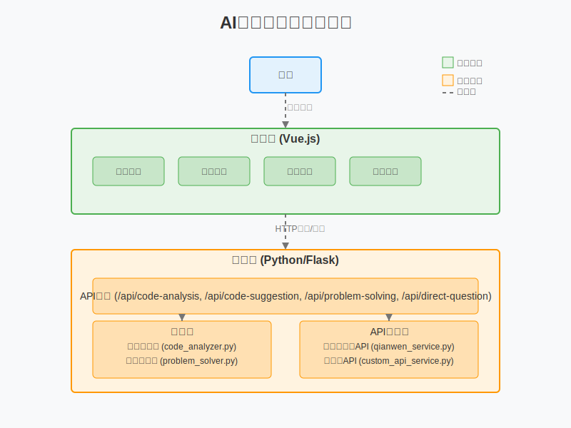

# AI 代码助手

这是一个集成了HTML/CSS/Vue.js前端和Python后端的AI代码助手项目，旨在帮助用户处理编程相关问题。

## 项目概述

本系统采用前后端分离架构，由以下几个主要层次组成：

1. **用户层**：最终用户通过浏览器访问系统
2. **前端层**：基于Vue.js的用户界面
3. **后端层**：基于Python/Flask的服务端
4. **API集成层**：与外部AI服务的集成

## 项目结构

```
ai-code-assistant/
├── frontend/                # 前端Vue.js应用
│   ├── index.html          # 主HTML文件
│   ├── styles/             # CSS样式
│   │   └── main.css        # 主样式文件
│   └── scripts/            # JavaScript脚本
│       └── main.js         # Vue应用主脚本
├── backend/                # 后端Python应用
│   ├── api/                # API路由
│   ├── models/             # 数据模型
│   ├── services/           # 业务逻辑
│   └── utils/              # 工具函数
```

## 功能特点

- **代码分析**：分析您的代码质量，找出潜在问题和改进空间
- **代码建议**：获取针对您代码的具体改进建议和最佳实践
- **问题解决**：描述您遇到的编程问题，获取解决方案和解释
- **直接提问**：直接向AI提问任何编程相关问题，获取即时回答

## 技术栈

- **前端**：HTML、CSS、Vue.js 2.6、Axios
- **后端**：Python、Flask、RESTful API
- **API集成**：阿里云千问API、自定义API、支持多种编程语言（Python、JavaScript、Java、C#、C++）

## 系统架构详细说明

本文档详细说明了AI代码助手项目的系统架构设计，配合下方的系统架构图使用。




### 1. 用户层

用户通过浏览器访问系统，与前端界面进行交互，提交代码分析、代码建议、问题解决和直接提问等请求。

### 2. 前端层 (Vue.js)

前端采用Vue.js 2.6框架开发，主要组件包括：

- **代码分析**：用户提交代码，获取质量分析和潜在问题
- **代码建议**：获取针对代码的具体改进建议和最佳实践
- **问题解决**：描述编程问题，获取解决方案和解释
- **直接提问**：向AI提问任何编程相关问题

前端通过Axios库与后端API进行HTTP通信，发送用户请求并接收响应结果。

### 3. 后端层 (Python/Flask)

后端采用Python语言和Flask框架开发，主要包含以下部分：

#### 3.1 API路由

- **/api/code-analysis**：处理代码分析请求
- **/api/code-suggestion**：处理代码建议请求
- **/api/problem-solving**：处理问题解决请求
- **/api/direct-question**：处理直接提问请求

#### 3.2 服务层

- **代码分析器(code_analyzer.py)**：分析代码质量和潜在问题
- **建议生成器(suggestion_generator.py)**：生成代码改进建议
- **问题解决器(problem_solver.py)**：解决编程问题

#### 3.3 API集成层

- **阿里云千问API服务(qianwen_service.py)**：集成阿里云千问大模型API
- **自定义API服务(custom_api_service.py)**：集成自定义API

### 4. 数据流

1. 用户在前端界面提交请求
2. 前端通过Axios发送HTTP请求到后端API
3. 后端API路由接收请求并调用相应服务
4. 服务层处理请求，必要时调用API集成层
5. API集成层与外部AI服务通信
6. 处理结果通过API路由返回给前端
7. 前端展示结果给用户

## 扩展性考虑

系统设计考虑了以下扩展性因素：

1. **模块化设计**：各功能模块独立，便于扩展和维护
2. **API抽象**：统一的API接口设计，便于添加新功能
3. **多API集成**：支持多种AI服务API，可根据需求切换

## 使用指南

当您需要帮助时，请提供具体的问题描述，我们的AI助手将为您提供有针对性的解决方案。如果需要更多信息来解决问题，系统会礼貌地询问。

我们的目标是始终保持友好、专业的态度，并尽可能提供最有价值的帮助。

## 新功能：阿里云千问API集成

本项目已集成阿里云千问大模型API，可以提供更专业的编程问题解决方案。在"问题解决"页面中，勾选"使用阿里云千问API"选项即可启用此功能。

详细配置说明请参考 `backend/README.md` 文件。